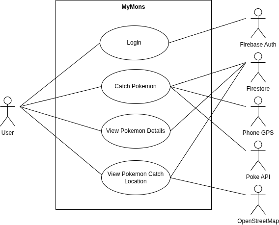
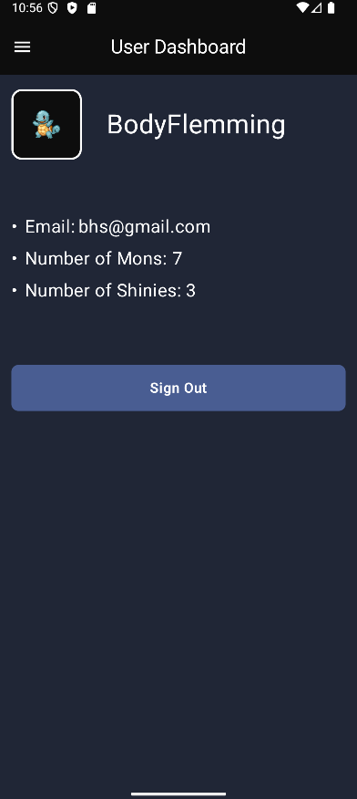
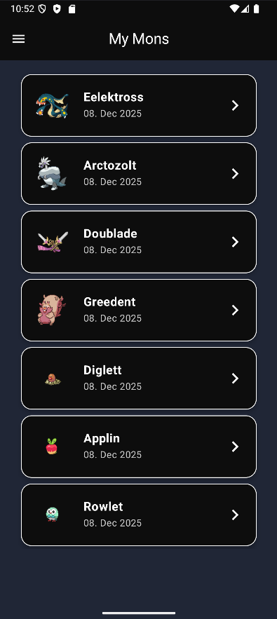
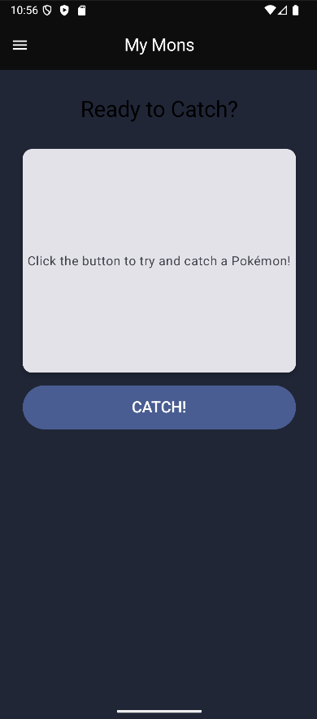
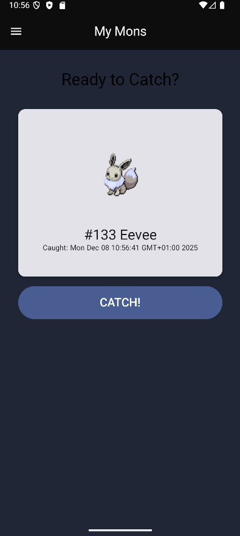
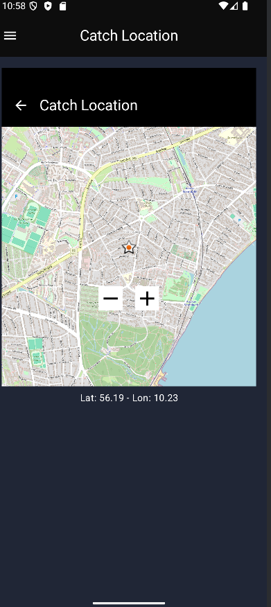
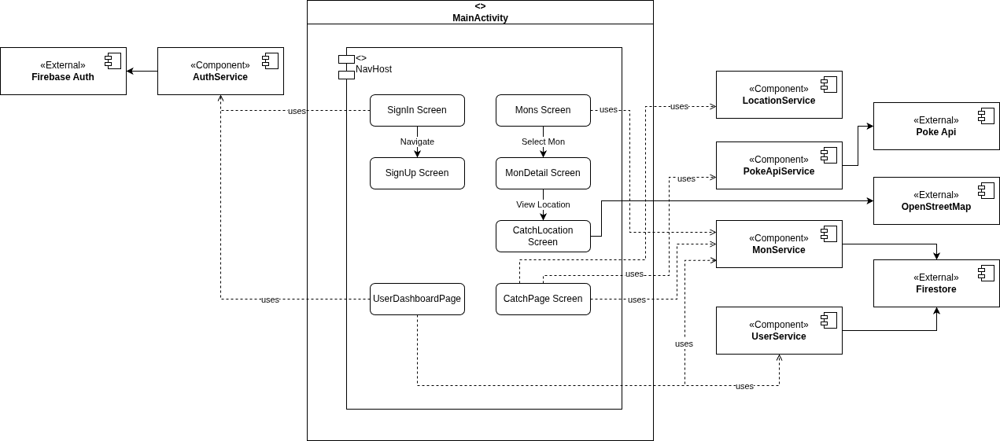

# MyMons

<title>MyMons</title>

| App project 10 |
| -------------- |

| Navn                    | Studienummer |
| ----------------------- | ------------ |
| Lasse Borring Petersen  | 202208165    |
| Benjamin Harboe Strunge | 202209864    |
| Esben Inglev            | 202210050    |

## App Vision

The app allows users to collect and view rare Pokémon, which you can boast about and show off to your friends.
Users can catch random Pokémon through the app, store them in their collection, and see where each Pokémon was caught on a map. The app combines fun with technology by integrating Firebase Authentication for secure user accounts, Firestore for storing user and Pokémon data, and PokéAPI for fetching Pokémon information such as names, images, and types.

Each user has a personal profile where they can view account details and manage their collection. The app aims to create a light, gamified experience where users can feel a sense of progression and ownership over their Pokémon while exploring real-world locations through GPS.

<div style="page-break-before: always;"></div>

## Test User

Credentials for the test user:

```
mail: test@gmail.com
password: Tester123!
```

## User-stories

- Auth:
  - 1.a: As a user, I want to be able to navigate to a sign-up page, and create an account with a username and an icon.
  - 1.b: As a user, I would like to be able to navigate to a login page, and enter my email and password to login.
- Catch:
  - 2.a: As a user, I want to navigate to the "Catch mon" page and obtain a randomly generated mon
- Collection:
  - 3.a: As a user, I want to view all pokémon that I have caught in an overview.
  - 3.b: As a user, I want to be able to click on a specific pokémon, to view details about it.
  - 3.c: As a user, I want to view on a map where a specific pokémon was obtained.
- Profile:
  - 4.a: As a user I want to navigate to the "My profile" page where I can view all the details about my account

### Use Case Diagrams

Below is the use case diagrams for the app, with not all, but the most relevant use cases included. As this report is required to mix user-stories and use cases, here's an overview of what user-story each use case is connected to:

- Login: 1.b
- Catch Pokemon: 2.a
- View Pokemon Details: 3.b
- View Pokemon Catch Location: 3.c

{width=100%}

<div style="page-break-before: always;"></div>

## UI Diagrams

### Profile page and collection page

<!--  -->
<!--  -->

{width=50%}
{width=50%}

### Pokemon catch page

<!--  -->
<!--  -->

{width=50%}
{width=50%}

### Pokemon details and catch location

<!--  -->
<!--  -->

{width=50%}
{width=50%}

## Component Diagrams

Below is the component diagram of the system. The diagram is bit more verbose than most component diagrams, in order to show what pages uses which services.

{width=110%}

As can be seen, most of the external dependencies have their own service, each located in their own `.kt` file in the app source. It should be noted, that the app provider or choice, OpenStreetMap, doesn't, as it is only used in a single place (the catch location detail page).

## Conclusion

The app has fullfilled all of the user stories. A user can signup, login, catch a mon and view their mons.

The app UI in itself is pretty simple, but the software architecture of the app has been the real challenge. With multiple external dependencies the team has obtained significant knowledge on how to connect a kotlin app to these sources. This has been done via configurable files such as the gradle files, .toml file and the manifest. This has been done for dependencies such as Firestore, Authentication and OpenStreetMap. For external REST based APIs the team has used simple serialization. This has been done for the PokeApi

The team has also gained insight in how to structure a Kotlin app. After multiple iterations of the structure the team decided to implement a classic service oriented logic flow, but without ViewModels, as this was deemed to be overkill for an app of this size.

## Known bugs

- When using the dynamic capabilities of the map in the mon details view, the map does not always retain it's original dimensions and position.
- When using the map, the navigation drawer may interfere with the map scrolling.
